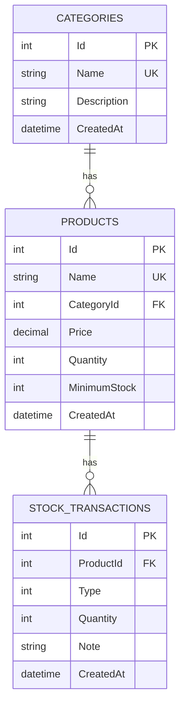

# 03 — Database Design

## 1. ERD



`Type`: `1 = In`, `2 = Out` (enum dalam C#).

## 2. Tables

### categories

| Column | Type | Rules |
|--------|------|--------|
| Id | INTEGER PK | Identity |
| Name | TEXT | Required, max 80, **unique** |
| Description | TEXT | Optional, max 255 |
| CreatedAt | TEXT/datetime | Default UTC now |

### products

| Column | Type | Rules |
|--------|------|--------|
| Id | INTEGER PK | Identity |
| Name | TEXT | Required, max 120, **unique** |
| CategoryId | INTEGER FK | Required, `ON DELETE RESTRICT` |
| Price | DECIMAL(18,2) | >= 0 |
| Quantity | INTEGER | >= 0 |
| MinimumStock | INTEGER | >= 0 |
| CreatedAt | datetime | Default UTC now |

Index: `CategoryId`, `Name`.

### stock_transactions

| Column | Type | Rules |
|--------|------|--------|
| Id | INTEGER PK | Identity |
| ProductId | INTEGER FK | `ON DELETE CASCADE` |
| Type | INTEGER | 1 or 2 |
| Quantity | INTEGER | > 0 (kuantiti **gerak**, bukan baki) |
| Note | TEXT | Optional, max 255 |
| CreatedAt | datetime | Default UTC now |

Index: `ProductId`, `CreatedAt`.

Nama table EF: `Categories`, `Products`, `StockTransactions`.

## 3. Business rules (penting)

1. **Stock out** hanya sah jika `request.Quantity <= product.Quantity`.
2. Selepas out, `product.Quantity` tidak pernah `< 0`.
3. **Stock in/out** sentiasa insert row transaction **dan** update `products.Quantity` dalam **satu** `SaveChanges` (satu unit kerja).
4. Jangan padam `Category` jika ada produk (`products.Any(p => p.CategoryId == id)`).
5. Padam `Product` → transaction ikut padam (cascade).
6. Status stok **tidak disimpan** dalam DB — kira dari Quantity + MinimumStock (derived).

### Formula status (frontend & API boleh share logic)

```
if (quantity === 0)            → OutOfStock
else if (quantity <= minStock) → LowStock
else                           → InStock
```

## 4. Seed data (first run)

Supaya dashboard tidak 0/0/0/0:

**Categories**

| Id | Name |
|----|------|
| 1 | Electronics |
| 2 | Stationery |
| 3 | Grocery |

**Products** (contoh)

| Name | Category | Price | Qty | Min |
|------|----------|-------|-----|-----|
| USB Cable | Electronics | 9.90 | 45 | 10 |
| Wireless Mouse | Electronics | 29.00 | 8 | 10 |  ← low stock |
| A4 Paper Ream | Stationery | 12.50 | 0 | 5 |   ← out of stock |
| Blue Pen | Stationery | 1.20 | 200 | 50 |
| Instant Noodles | Grocery | 2.50 | 15 | 20 | ← low stock |
| Bottled Water | Grocery | 1.00 | 3 | 12 |  ← low stock |

Selepas seed, dashboard kasar:

- Total Products: 6
- Total Stock: 45+8+0+200+15+3 = **271**
- Low Stock: Mouse, Noodles, Water = **3**
- Out of Stock: Paper = **1**

Anda boleh tambah lagi produk sendiri sampai nampak macam contoh 120 / 3,450.

## 5. Apa yang TIDAK ada dalam DB

- `Status` column — derived
- `UpdatedAt` — skip v1
- UserId pada transaction — tiada login
- SKU/barcode — skip v1 (boleh tambah column later tanpa pecahkan app)

## 6. Mapping ke contoh asal

Contoh anda:

```
Products: Id, Name, Category, Price, Quantity, MinimumStock, CreatedAt
```

Dalam relational design, `Category` jadi **table + FK**, bukan string bebas. Nama kategori tetap nampak di UI melalui `product.category.name`.
